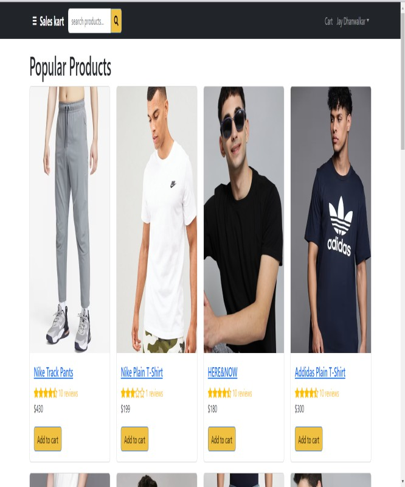

# MERN SALEKART WEBSITE

Welcome to the MERN Ecommerce Website repository!

## Overview
This repository hosts an Ecommerce Website built using the MERN (MongoDB, Express.js, React.js, Node.js) stack. Whether you're an entrepreneur looking to start your online store or a developer interested in learning how to build a full-fledged ecommerce platform, this project provides a comprehensive solution.

## Features
- **User Authentication:** Secure user authentication system allowing users to sign up, log in, and manage their accounts.
- **Product Management:** Admin panel for managing products, including CRUD operations (Create, Read, Update, Delete).
- **Shopping Cart:** Interactive shopping cart functionality for users to add and remove items before checkout.
- **Order Management:** Complete order management system, allowing users to place orders and track their status.
- **Payment Integration:** Integration with popular payment gateways to facilitate secure and seamless transactions.
- **Responsive Design:** Mobile-friendly design ensuring a seamless shopping experience across devices.

## Getting Started
To get started with the MERN Ecommerce Website, follow these steps:
1. Clone this repository to your local machine.
2. Navigate to the project directory and install dependencies by running `npm install` in both the client and server directories.
3. Set up your MongoDB database and configure the connection string in the server environment variables.
4. Start the server by running `npm start` in the server directory.
5. Start the client by running `npm start` in the client directory.
6. Access the website in your browser at `http://localhost:3000`.

## Usage
1. As a user, sign up for an account or log in if you already have one.
2. Browse through the products, add items to your cart, and proceed to checkout.
3. Enter your shipping details and choose a payment method to complete your purchase.
4. As an admin, log in to the admin panel to manage products, orders, and users.

## Contributing
Contributions are welcome! If you'd like to contribute to this project, please fork the repository and submit a pull request with your changes.

## Acknowledgements
- This project was inspired by the need for a customizable and scalable ecommerce solution built on modern technologies.

## Contact
If you have any questions, suggestions, or feedback, feel free to contact us at jaydhanwalkar123@gmail.com. We'd love to hear from you!

Happy Ecommerce-ing! 🛍️
